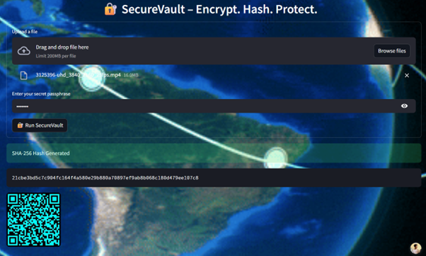
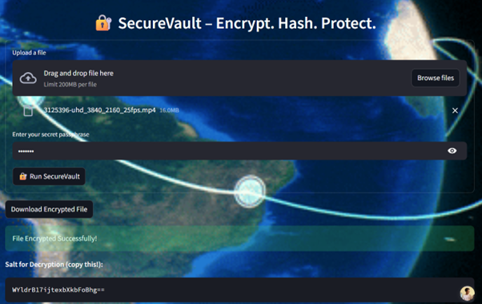

# 🔐 SecureVault Pro

> A Secure File Hashing and AES Encryption App  
> Built with 💻 Python · Python \xb7 ⚙️ Streamlit · Streamlit \xb7 🔐 Cryptography

<div align="center">

🌐 **Live Demo**:  
👉 [securevault-pro.streamlit.app](https://securevault-pro.streamlit.app/)

</div>

---

## 🤩 What is SecureVault Pro?

**SecureVault Pro** is a sleek and modern web app that lets you:

- 🦾 Generate secure **SHA-256** hashes for any file
- 🔐 **Encrypt & Decrypt** files using AES with a passphrase
- 🧂 Use **PBKDF2 + salt** to derive strong encryption keys
- 📷 Visualize hashes using **QR codes** for portable integrity
- 📁 Work with **any file format** – text, PDFs, images, zips & more

Built with security, clarity, and user experience in mind.

---

## ✨ Features

| Feature           | Description                                                                 |
|------------------|-----------------------------------------------------------------------------|
| 🦾 SHA-256 Hash   | Hash any file to verify integrity or generate digital fingerprints          |
| 🔐 AES Encryption | Encrypt your files with passphrase-based AES using secure salt + PBKDF2     |
| 🔓 AES Decryption | Decrypt only with the correct passphrase + matching salt                    |
| 🧂 Salt Display   | Copyable, persistent salt shown after encryption                            |
| 📷 QR Code Output | Visual QR for SHA-256 hash (share or verify on other devices)               |
| 🎈 Smooth UI      | Minimal, animated, and responsive interface powered by Streamlit            |

---

## 📷 Screenshots

| Hash + QR Code                        | File Encryption                        |
|--------------------------------------|----------------------------------------|
|         |     |

> *(Place your own screenshots in the `assets/` folder to match your UI)*

---

## 🚀 Try It Live

👉 **No install required!** Just open the app in your browser:

📍 [https://securevault-pro.streamlit.app](https://securevault-pro.streamlit.app)

---

## 🛠️ Local Installation

```bash
git clone https://github.com/yourusername/securevault-pro.git
cd securevault-pro
pip install -r requirements.txt
streamlit run app.py
```

---

## 📁 Folder Structure

```
securevault-pro/
│
├── app.py                    # Main Streamlit app
├── requirements.txt          # Dependencies
├── assets/                   # Background, icons, screenshots
├── utils/                    # Modular logic for encryption, hashing, etc.
│   ├── encryption.py
│   ├── hashing.py
│   ├── keygen.py
│   ├── file_handler.py
│   ├── visuals.py
│   └── qrgen.py
```

---

## 📄 License

This project is open-sourced under the **MIT License**.

---

## ✨ Credits

Made with ❤️ by [Your Name](https://github.com/yourusername)  
Originally built as a personal/professional project to showcase secure encryption UIs.
